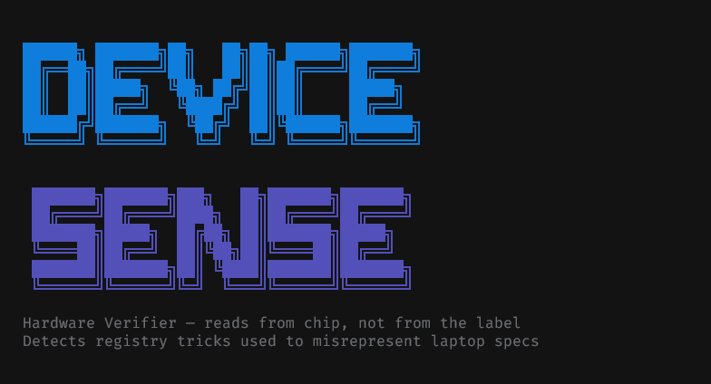

<div align="center">
  
</div>

---

> **A hardware verification tool that reads directly from the chip — not from the label.**  
> Built to catch a real trick used to misrepresent laptop specs on Windows.

---

## The Problem

On Windows, the CPU name shown in **Settings → System → About** and in **Device Manager** is pulled from a registry key:

```
HKLM\HARDWARE\DESCRIPTION\System\CentralProcessor\0\ProcessorNameString
```

This is just a display string. **Any admin can change it.** There are videos online showing how a laptop sold as an i7 can be made to show as an i9 in Windows Settings in under 30 seconds — with no technical knowledge required.

People have been buying used (and even new) laptops based on what Windows tells them, paying i9 prices for i5 hardware. There is no warning. The settings page looks completely legitimate.

---

## The Solution

**Device Sense** reads hardware information directly from the source — bypassing the registry entirely:

| Data | Source |
|---|---|
| CPU name | WMI `Win32_Processor` → CPUID instruction on the chip |
| CPU cores, speed, arch | Same WMI query, direct from firmware |
| RAM total + slot info | SMBIOS firmware via `Win32_PhysicalMemory` |
| Storage drives | `Win32_DiskDrive` device drivers |
| GPU | `Win32_VideoController` |
| System identity | `Win32_BIOS` + `Win32_ComputerSystem` |

It then **compares the registry display string against the real WMI name** and flags any mismatch. If someone changed the label, you'll see it.

On Linux and macOS the registry check doesn't apply (no such concept exists), but all hardware is still read directly from `/proc`, `sysctl`, and `system_profiler`.

---

## How It Works

```
┌─────────────────────────────────────────────────────┐
│  Windows Registry                                   │
│  HKLM\...\CentralProcessor\0\ProcessorNameString   │  ← editable display string
│  "Intel Core i9-12900H"  ← could be fake           │
└───────────────────┬─────────────────────────────────┘
                    │  compared against
┌───────────────────▼─────────────────────────────────┐
│  WMI / CimInstance                                  │
│  Get-CimInstance Win32_Processor                    │  ← reads CPUID from chip
│  "Intel Core i5-7200U"   ← this is real            │
└─────────────────────────────────────────────────────┘
                    │
                    ▼
        ⚠ MISMATCH — spec has been altered
```

The binary is written in Go and uses PowerShell's `-EncodedCommand` to run WMI queries reliably — no temp files, no escaping issues, clean UTF-8 output. Animations, spinners, and progressive disclosure are handled natively in the Go binary.

---

## Install

**Windows (PowerShell):**
```powershell
irm https://raw.githubusercontent.com/jeffreyon/device-sense/main/install.ps1 | iex
```

**macOS / Linux / Windows (Git Bash or WSL):**
```bash
curl -fsSL https://raw.githubusercontent.com/jeffreyon/device-sense/main/install.sh | bash
```

After installing, open a new terminal and run:

```
device-sense
```

---

## Platform Support

| Platform | Registry Check | Hardware Info |
|---|---|---|
| Windows | ✓ Full mismatch detection | ✓ CPU, RAM slots, Storage, GPU, BIOS |
| macOS | — N/A | ✓ via `sysctl` + `system_profiler` |
| Linux | — N/A | ✓ via `/proc`, `lsblk`, `lspci` |
| WSL | — N/A | ✓ with WSL-aware notes |

> The registry tamper check is Windows-only by design — that attack vector only exists on Windows.

---

## Build from Source

Requires [Go 1.21+](https://go.dev/download).

```bash
git clone https://github.com/jeffreyon/device-sense.git
cd device-sense
go build -o device-sense .
```

Cross-compile for any platform:
```bash
GOOS=windows GOARCH=amd64 go build -o device-sense.exe .
GOOS=linux   GOARCH=amd64 go build -o device-sense-linux .
GOOS=darwin  GOARCH=amd64 go build -o device-sense-macos .
```

Pre-built binaries for every platform are available on the [Releases](https://github.com/jeffreyon/device-sense/releases) page, built automatically via GitHub Actions on every tagged release.

---

## Why This Exists

A friend asked how they could actually verify a laptop's specs before buying. I showed them the registry trick, and then built this so they — and anyone else — could check for themselves without needing to know any of that.

If this saved you from a bad deal, share it.

---

<div align="center">

**Support the project**

[Share it with someone buying a laptop](https://wa.link/b11q29) · Refer me for a project · Send money for data and pizza (`8085709543 — Opay`)

*anything your hand reach*

</div>
